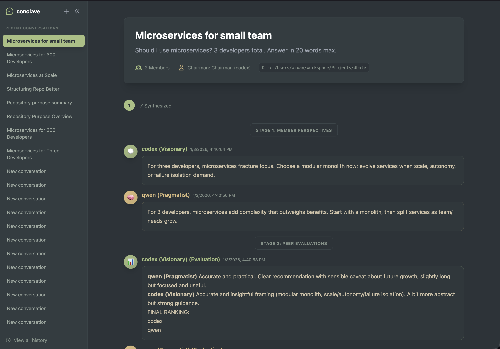

# conclave

AI-powered multi-agent deliberation platform that orchestrates debates and council discussions between AI agents with diverse personas.



> **Note:** This project is 99.9% vibe coded. Expect rough edges, experimental features, and the occasional surprise.

**Based on:** [karpathy/llm-council](https://github.com/karpathy/llm-council) — reimplemented to work with existing CLI coding agents (Claude, Gemini, Qwen, etc.) instead of direct API calls.

## Features

- **Multi-Agent Councils** — Run discussions with N agents using a 3-stage pipeline (Responses → Ranking → Synthesis)
- **Real-Time Streaming UI** — React 19 SPA with character-by-character SSE streaming
- **Multi-Provider Support** — Works with Claude, Gemini, Qwen, OpenCode, and other AI CLI tools
- **Custom Personas** — Create AI agents with unique personalities (Optimist, Skeptic, Pragmatist, etc.)
- **Debate Styles** — Choose from Adversarial, Collaborative, Socratic, or define your own
- **Session History** — SQLite persistence for all debates and councils
- **Export Options** — Save deliberations as Markdown, PDF, or JSON

## Installation

**Prerequisites:** Go 1.21+, Node.js/npm, and at least one AI CLI tool ([Claude](https://docs.anthropic.com/claude/docs/claude-cli), [Gemini](https://cloud.google.com/vertex-ai/docs/generative-ai/start/quickstarts/quickstart-cli), [Qwen](https://github.com/QwenLM/Qwen), etc.)

```bash
git clone https://github.com/alienxp03/conclave.git
cd conclave
make build
make install
```

## Quick Start

### CLI Usage

```bash
# Start a basic debate
conclave new "Should we use Go for our next microservice?"

# Multi-agent council with custom personas
conclave new "Project Roadmap 2026" \
  --models claude:optimist,gemini:skeptic,qwen:pragmatist

# View and manage sessions
conclave list              # Session history
conclave show <id>         # View details
conclave export <id> pdf   # Export to PDF
```

### Web Interface

```bash
conclave serve --port 8080
```

Visit `http://localhost:8080` for:
- Real-time streaming debates with character-by-character rendering
- Session history browser
- Visual council and debate configuration

### Advanced

```bash
# Custom personas
conclave persona create --id researcher --name "Deep Researcher" \
  --prompt "You are a meticulous researcher..."

# Manage debate styles
conclave style list
conclave style show socratic

# Config file
conclave config init
conclave config show
```

## Architecture

```
conclave/
├── cmd/              # CLI and server entry points
├── internal/
│   ├── council/      # N-agent deliberation logic
│   ├── engine/       # 2-agent debate orchestration
│   ├── provider/     # AI provider abstractions (CLI wrappers)
│   ├── storage/      # SQLite persistence
│   └── workspace/    # Project workspace management
├── web/
│   ├── app/          # React 19 frontend (Vite + TS + Tailwind)
│   └── handlers/     # HTTP handlers and SSE streaming
```

## Development

```bash
make dev-frontend     # Frontend dev server with hot reload
make dev-serve        # Backend with auto-reload (requires air)
make test             # Run test suite
```

## License

MIT